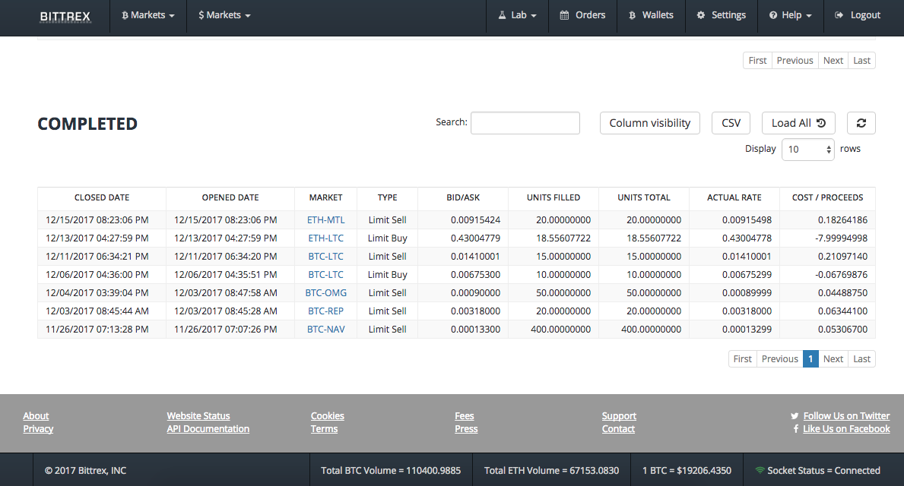

# FIFO Tax Computation

## About
The code allows you to parse through your transaction history (see Obtaining CSV) on the Bittrex exchange and compute cost basis using a first-in-first-out (FIFO) method.

Currently does not account for deposits / withdrawals.

### Obtaining CSV
Download your Bittrex transaction history on the order page by clicking CSV button on completed orders.
